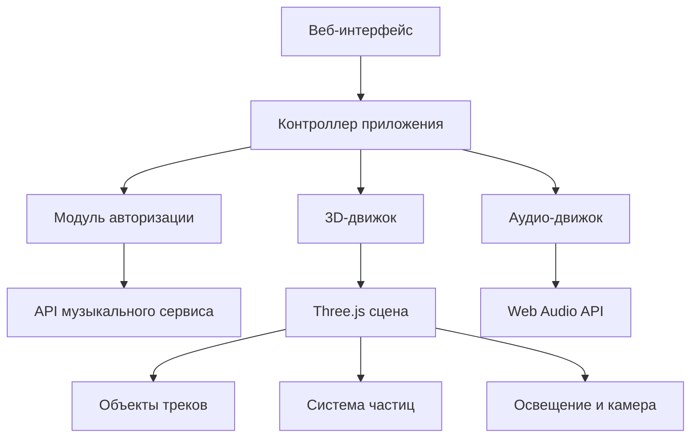

# Документ дизайна

## Обзор

Интерактивная 3D-визуализация музыкальных предпочтений - это веб-приложение, построенное на Three.js, которое создает иммерсивную "галактику" из музыкальных треков пользователя. Приложение интегрируется с музыкальными сервисами через API, обрабатывает данные о треках и создает красивую 3D-сцену с интерактивными объектами.

## Архитектура

### Высокоуровневая архитектура



### Архитектура модулей

- **AuthModule**: Управление авторизацией и API-запросами
- **DataProcessor**: Обработка и анализ музыкальных данных
- **SceneManager**: Управление 3D-сценой и объектами
- **InteractionManager**: Обработка пользовательского ввода
- **AudioManager**: Управление воспроизведением превью
- **AnimationManager**: Управление анимациями и эффектами

## Компоненты и интерфейсы

### 1. AuthModule

```typescript
interface AuthModule {
  authenticate(): Promise<AuthToken>;
  refreshToken(): Promise<AuthToken>;
  getUserPlaylists(): Promise<Playlist[]>;
  getTrackData(trackId: string): Promise<Track>;
}

interface AuthToken {
  accessToken: string;
  refreshToken: string;
  expiresIn: number;
}
```

### 2. DataProcessor

```typescript
interface DataProcessor {
  processTrackData(tracks: Track[]): ProcessedTrack[];
  analyzeGenres(tracks: Track[]): GenreStats;
  calculatePopularity(track: Track): number;
}

interface ProcessedTrack {
  id: string;
  name: string;
  artist: string;
  genre: string;
  popularity: number;
  duration: number;
  previewUrl?: string;
  color: string;
  size: number;
  position: Vector3;
}
```

### 3. SceneManager

```typescript
interface SceneManager {
  initializeScene(): void;
  createTrackObjects(tracks: ProcessedTrack[]): void;
  updateScene(): void;
  dispose(): void;
}

interface TrackObject extends THREE.Mesh {
  trackData: ProcessedTrack;
  originalPosition: Vector3;
  isSelected: boolean;
}
```

### 4. InteractionManager

```typescript
interface InteractionManager {
  handleMouseMove(event: MouseEvent): void;
  handleClick(event: MouseEvent): void;
  handleWheel(event: WheelEvent): void;
  selectTrack(trackObject: TrackObject): void;
  deselectTrack(): void;
}
```

### 5. AudioManager

```typescript
interface AudioManager {
  playPreview(url: string): Promise<void>;
  stopPreview(): void;
  setVolume(volume: number): void;
  getCurrentTime(): number;
}
```

## Модели данных

### Track

```typescript
interface Track {
  id: string;
  name: string;
  artist: string;
  album: string;
  genre: string;
  duration: number; // в секундах
  popularity: number; // 0-100
  previewUrl?: string;
  imageUrl?: string;
  playCount?: number;
}
```

### Playlist

```typescript
interface Playlist {
  id: string;
  name: string;
  tracks: Track[];
  totalTracks: number;
}
```

### GenreStats

```typescript
interface GenreStats {
  [genre: string]: {
    count: number;
    percentage: number;
    color: string;
  };
}
```

### SceneConfig

```typescript
interface SceneConfig {
  galaxyRadius: number;
  objectMinSize: number;
  objectMaxSize: number;
  animationSpeed: number;
  cameraDistance: number;
  genreColors: { [genre: string]: string };
}
```

## Детали реализации

### 3D-сцена и объекты

**Геометрия объектов:**

- Основная форма: IcosahedronGeometry для кристаллического вида
- Альтернативные формы: SphereGeometry, ConeGeometry в зависимости от жанра
- Размер объекта: базовый размер 0.5-3.0 единиц, масштабируется по популярности

**Материалы:**

- MeshStandardMaterial с поддержкой PBR
- Emissive свойства для свечения объектов
- Прозрачность для эффектов выделения

**Расположение объектов:**

- Сферическое распределение в пространстве радиусом 50 единиц
- Группировка по жанрам в определенных секторах
- Случайное смещение для естественного вида

### Цветовая схема

```typescript
const GENRE_COLORS = {
  metal: "#FF0000", // Красный
  rock: "#FF4500", // Оранжево-красный
  indie: "#4169E1", // Синий
  pop: "#FFD700", // Желтый
  electronic: "#9400D3", // Фиолетовый
  jazz: "#228B22", // Зеленый
  classical: "#F5F5DC", // Бежевый
  "hip-hop": "#8B4513", // Коричневый
  default: "#FFFFFF", // Белый
};
```

### Анимации

**Основное вращение:**

- Все объекты медленно вращаются вокруг центра сцены
- Скорость: 0.001 радиан/кадр
- Каждый объект также вращается вокруг своей оси

**Интерактивные анимации:**

- Приближение камеры: плавный переход за 1 секунду
- Пульсация при воспроизведении: масштаб 0.9-1.1 в ритм музыки
- Появление объектов: fade-in эффект при загрузке

### Освещение

- **AmbientLight**: мягкое общее освещение (интенсивность 0.4)
- **DirectionalLight**: основной источник света (интенсивность 1.0)
- **PointLight**: динамический свет, следующий за выбранным объектом

### Система частиц

- Звездное поле на заднем плане (1000 частиц)
- Эффекты вокруг выбранного объекта (100 частиц)
- Использование PointsMaterial для оптимизации

## Обработка ошибок

### Сетевые ошибки

- Повторные попытки с экспоненциальной задержкой
- Fallback на демо-данные при недоступности API
- Уведомления пользователя о проблемах с подключением

### Ошибки WebGL

- Проверка поддержки WebGL при инициализации
- Graceful degradation для слабых устройств
- Сообщения о несовместимости браузера

### Ошибки аудио

- Обработка недоступных превью треков
- Автоматическое отключение звука при ошибках
- Альтернативные источники аудио

## Стратегия тестирования

### Модульные тесты

- Тестирование DataProcessor с mock-данными
- Тестирование математических функций для позиционирования объектов
- Тестирование обработки API-ответов

### Интеграционные тесты

- Тестирование взаимодействия между модулями
- Тестирование полного цикла загрузки и отображения данных
- Тестирование обработки ошибок

### E2E тесты

- Тестирование пользовательских сценариев
- Тестирование производительности на больших наборах данных
- Тестирование на различных устройствах и браузерах

### Тесты производительности

- Профилирование рендеринга сцены
- Тестирование памяти при большом количестве объектов
- Бенчмарки анимаций

## Оптимизация производительности

### Рендеринг

- Instanced rendering для одинаковых объектов
- Frustum culling для объектов вне поля зрения
- Level of Detail (LOD) для дальних объектов

### Память

- Переиспользование геометрий и материалов
- Lazy loading превью треков
- Очистка неиспользуемых ресурсов

### Сеть

- Кэширование API-ответов в localStorage
- Пагинация для больших плейлистов
- Сжатие изображений и аудио

## Безопасность

### API-ключи

- Хранение токенов в httpOnly cookies
- Автоматическое обновление токенов
- Шифрование чувствительных данных

### CORS и CSP

- Настройка CORS для API-запросов
- Content Security Policy для предотвращения XSS
- Валидация всех входящих данных
